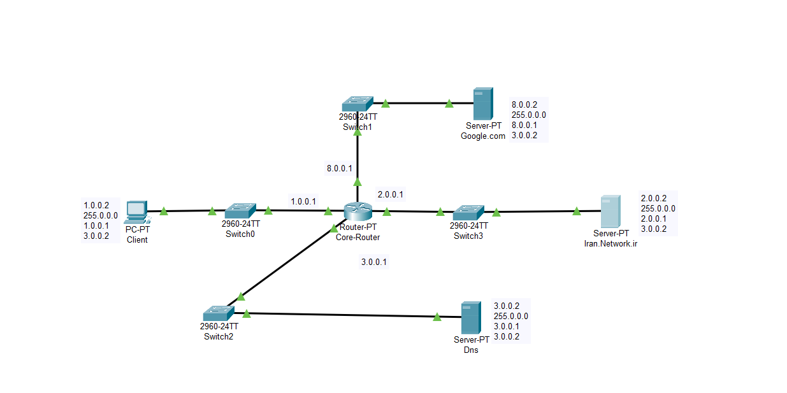

# Lab 01 - LAN, DNS and Web Server

## Overview

This lab demonstrates a basic LAN topology using Cisco Packet Tracer.

The network consists of:

- 1 Router
- 4 Switches
- 1 Client PC
- 1 DNS Server
- 2 Web Servers
  - google.com
  - iran.network.ir

The DNS server is configured to resolve both website domain names, allowing the client to access each web server through its domain name instead of using IP addresses.

## Network Topology

## Devices

| Device | Quantity |
|---------|---------:|
| Router | 1 |
| Switch | 4 |
| Client PC | 1 |
| DNS Server | 1 |
| Web Server | 2 |

## Features

- Static IPv4 Addressing
- DNS Configuration
- Web Server Configuration
- End-to-End Connectivity
- Ping Verification
- Website Access by Domain Name

## Verification

The following tests were completed successfully:

- ✅ Ping between all connected devices
- ✅ DNS name resolution
- ✅ Access to **google.com**
- ✅ Access to **iran.network.ir**

## Files

- `Lab-01-LAN-DNS-WebServer.pkt`
- `Topology.png`
- `screenshots/`
