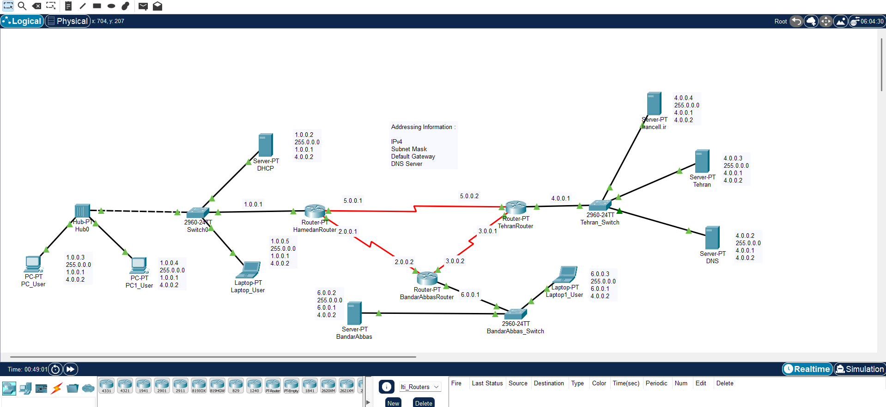

# Lab 03 - Multi-Router Static Routing

## Overview

This lab demonstrates a multi-router network using Cisco Packet Tracer.

The network consists of:

- 3 Routers configured with Static Routing
- 3 Switches
- 1 Hub
- 2 User PCs
- 2 User Laptops
- 1 DHCP Server
- 1 DNS Server
- 3 Web Servers
  - Tehran
  - Irancell.ir
  - BandarAbbas

The DHCP server automatically assigns IP addresses to client devices in the local network. Static routing is configured on all routers to provide communication between different networks. The DNS server resolves domain names, and the web servers are accessible from all connected networks.

## Network Topology

## Devices

| Device | Quantity |
|---------|---------:|
| Routers | 3 |
| Switches | 3 |
| Hub | 1 |
| User PCs | 2 |
| User Laptops | 2 |
| DHCP Server | 1 |
| DNS Server | 1 |
| Web Servers | 3 |

## Features

- Static IPv4 Addressing
- DHCP Configuration
- DNS Configuration
- Static Routing
- Multi-Router Network
- End-to-End Connectivity

## Verification

The following tests were completed successfully:

- ✅ Static routes configured on all routers
- ✅ End-to-end connectivity verified
- ✅ Successful ping between different networks
- ✅ DHCP address assignment
- ✅ DNS name resolution
- ✅ Access to all web servers

## Files

- `Lab-03-Multi-Router-Static-Routing.pkt`
- `Lab-03-Multi-Router-Network.png`
- `screenshots/`
