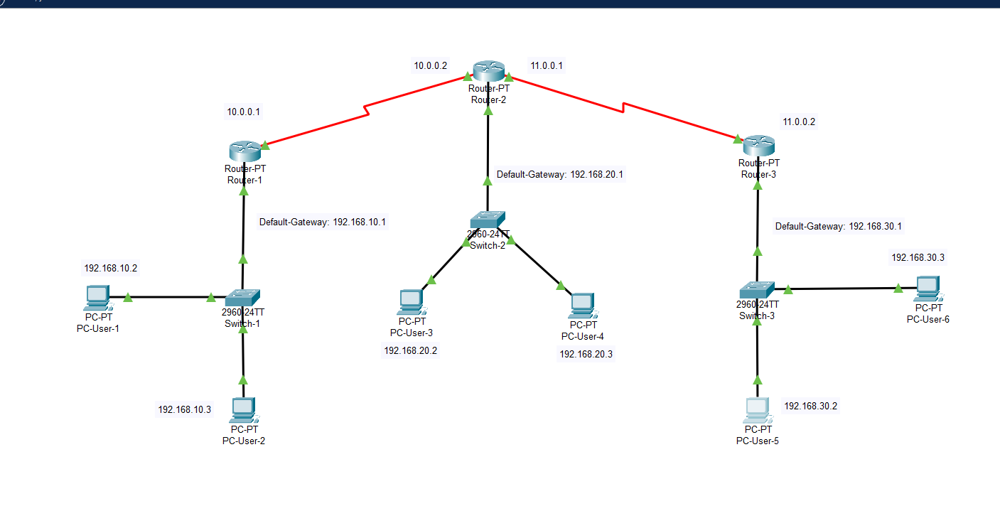

# Lab 04 - RIP Dynamic Routing

## Overview

This lab demonstrates a network using RIP dynamic routing in Cisco Packet Tracer.

The network consists of:

- 3 Routers configured with RIP Version 2 (RIPv2)
- 3 Switches
- 6 PCs

RIP is used to automatically exchange routing information between routers, allowing all networks to communicate without configuring static routes manually.

## Network Topology

## Devices

| Device | Quantity |
|---------|---------:|
| Routers | 3 |
| Switches | 3 |
| PCs | 6 |

## Features

- Dynamic Routing using RIP
- Automatic Route Advertisement
- IPv4 Addressing
- End-to-End Connectivity
- Multi-Router Network

## Verification

The following tests were completed successfully:

- ✅ RIP configured on all routers
- ✅ Automatic route learning
- ✅ Successful ping between all networks
- ✅ End-to-end connectivity verified

## Files

- `Lab-04-RIP-Dynamic-Routing.pkt`
- `Lab-04-RIP-Dynamic-Routing`
- `screenshots/`
